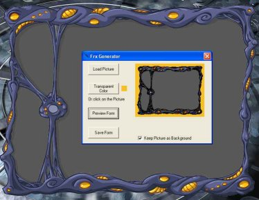



## Fastest Shaped forms and Save them as \.Frm File

### Description

Updated !!! Create Bitmap Shaped/Transparent Forms and SAVE them with or without Pictures. The new Form has no calculation to do no loading of background images minimal code on it (About 1K) .... Fast and easy way to make shaped forms. Fixed errors and increased the speed it up.
 
### More Info
 

             |
---                |---
**Submitted On**   |2005-01-11 23:11:48
**By**             |[Scythe](https://github.com/Planet-Source-Code/PSCIndex/blob/master/ByAuthor/scythe.md)
**Level**          |Intermediate
**User Rating**    |5.0 (45 globes from 9 users)
**Compatibility**  |VB 5\.0, VB 6\.0
**Category**       |[Graphics](https://github.com/Planet-Source-Code/PSCIndex/blob/master/ByCategory/graphics__1-46.md)
**World**          |[Visual Basic](https://github.com/Planet-Source-Code/PSCIndex/blob/master/ByWorld/visual-basic.md)
**Archive File**   |[Fastest\_Sh1839321122005\.zip](https://github.com/Planet-Source-Code/scythe-fastest-shaped-forms-and-save-them-as-frm-file__1-58208/archive/master.zip)

